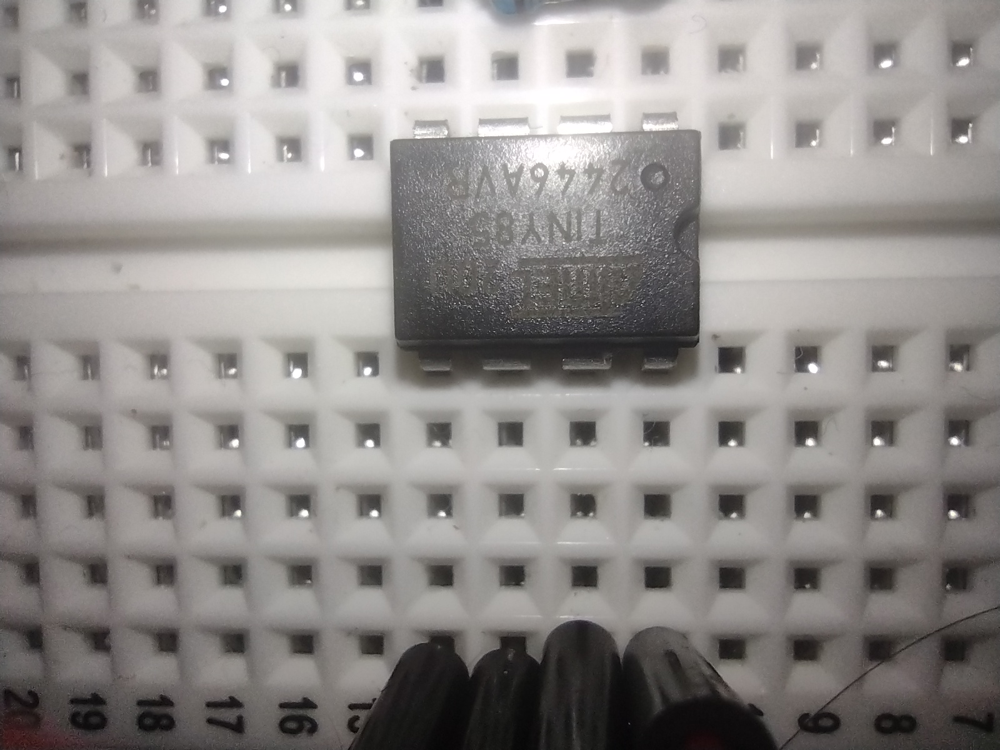
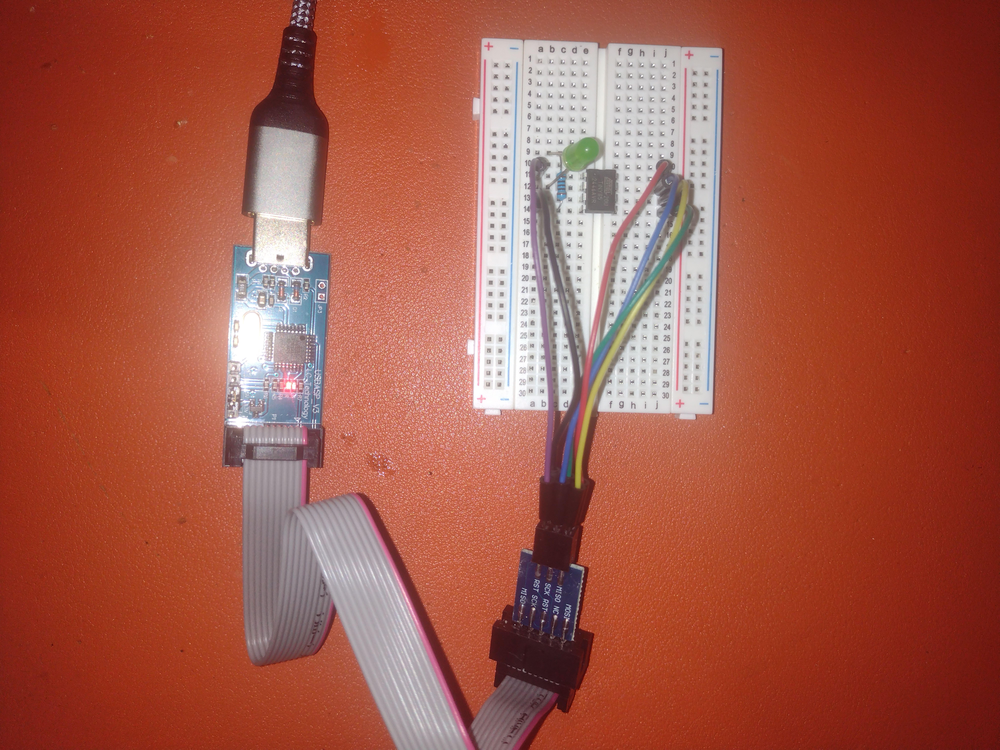

# ATTINY85

*Matt DiPalma, AMDG - April 29, 2025*

* [Datasheet](https://ww1.microchip.com/downloads/en/devicedoc/atmel-2586-avr-8-bit-microcontroller-attiny25-attiny45-attiny85_datasheet.pdf)



## Summary

The ATTiny85 is a small 8-bit microcontroller IC introduced in 1997 available as a surface mount package and in DIP-8 format. The latter can be had for roughly $1.50 apiece. It has 6 IO pins and the internal oscillator is 8 MHz, but divided by 8 by default. It has 4K 16-bit words (8KB) of memory for program code, 512 bytes of space for dynamic data during execution, and another 512 bytes of EEPROM that persists through reset/shutdown. It can be easily programmed using an AVR toolchain and the physical `USBasp` USB programmer.

### Minimal Toolchain

The following minimal toolchain was verified on 6.14.3-arch1-1 x86_64 GNU/Linux.

Install the following packages (sometimes it's called binutils-avr):
`sudo pacman -S avr-gcc avr-libc avr-binutils avrdude`

Navigate to the [ex01_blink_c](ex01_blink_c) directory in the terminal.

Compile code with:
`avr-gcc -mmcu=attiny85 -Wall -Os main.c -o main.elf`

Convert elf to hex file:
`avr-objcopy -j .text -j .data -O ihex main.elf main.hex`

For the USBasp programmer, connect the following pins:
* ATTINY85 PIN1 (RESET) - USBasp RESET
* ATTINY85 PIN2 - NOT CONNECTED
* ATTINY85 PIN3 - NOT CONNECTED
* ATTINY85 PIN4 (GND) - USBasp GND
* ATTINY85 PIN5 (MOSI) - USBasp MOSI
* ATTINY85 PIN6 (MISO) - USBasp MISO
* ATTINY85 PIN7 (SCK) - USBasp SCK
* ATTINY85 PIN8 (VCC) - USBasp VCC

Set up a circuit as shown below:



Flash the hex file to the device:
`sudo avrdude -c usbasp -p t85 -U flash:w:main.hex:i`

The terminal should print:
```
Reading 82 bytes for flash from input file main.hex
Writing 82 bytes to flash
Writing | ################################################## | 100% 0.12 s 
Reading | ################################################## | 100% 0.07 s 
82 bytes of flash verified

Avrdude done.  Thank you.
```

The code should start running immediately. If not, the RESET pin (PIN1) may need to be pulled HIGH, perhaps through a pull-up resistor.

### Minimal Examples
* [ex01_blink_c](ex01_blink_c) - simple LED blink example

### Observations
* On my machine the included `avr/io.h` is at `/usr/avr/include/avr/io.h`, which in turn includes `/usr/avr/include/avr/iotn85.h` which pulls in `vim /usr/avr/include/avr/iotnx5.h`. These contain various definitions for the pins and addresses, etc.
* The RESET pin (PIN1) is active low. That is, if you connect this pin to ground, the chip will reset.
