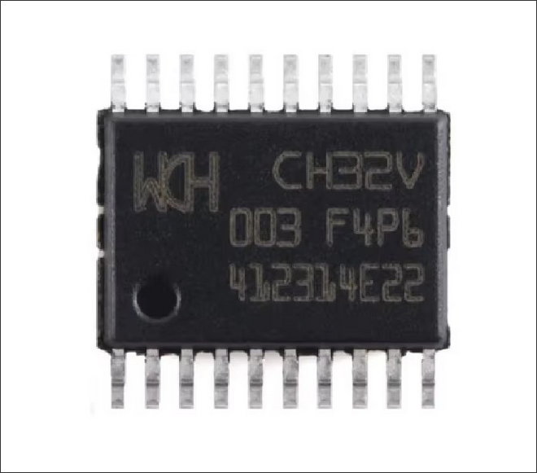
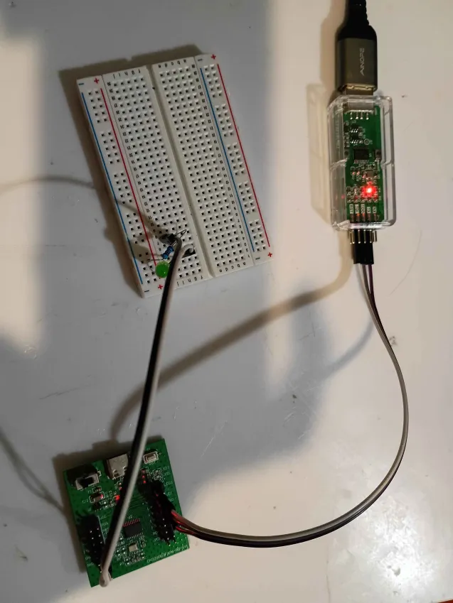

# CH32V003F4P6-R0-1v1 dev board

*Matt DiPalma, AMDG - April 9, 2026*

* [Datasheet](resources/CH32V003.pdf)



## Summary

The CH32V003 is a small 32-bit RISC-V core microcontroller series IC introduced in 2022 available in several surface mount packages or on a dev board. They can often be had for around $0.10-0.25 apiece. It has up to 18 GPIO pins and the internal oscillator is 48 MHz. It has 16KB flash, 2KB SRAM, and a bunch of peripherals like ADC, UART, and on some packages, a working SPI. It can be easily programmed using either the `ch32v003fun` toolchain (with many library functions and examples) or perhaps more easily directly in assembly using standard RISC-V toolchain. The programming is done via 3-wire (VCC, GND, SWDIO) connection to the board using the physical `WCH LinkE` USB programmer (~$5) and the `minichlink` command line program.

### Minimal Toolchain

The following minimal toolchain was verified on 6.19.9-arch1-1 x86_64 GNU/Linux.

To get the `minichlink` program, either build the full `ch32v003fun` toolchain or build it alone:
```git clone --depth 1 https://github.com/cnlohr/ch32v003fun.git
cd ch32v003fun/minichlink
make
sudo cp minichlink /usr/local/bin/
```

If you don't want to use the `ch32v003fun` toolchain, you will still need the minichlink executable from above. For direct assembly (or C) programming, install the following packages:
```sudo pacman -S riscv64-elf-gcc riscv64-elf-binutils```

# Circuit Setup

Connect the following pins between the `WCH LinkE` programmer, and the chip (`ch32v003f4p6-r0-1v1` dev board shown for simplicity):
* CH32V003 VCC - PROGRAMMER 3.3V
* CH32V003 GND - PROGRAMMER GND
* CH32V003 PD1 - PROGRAMMER SWDIO

Set up a circuit as shown below:



# ch32v003fun C Programming

No documentation yet.

# Direct Assembly (or C) Programming

Navigate to the [ex02_blink_asm](ex02_blink_asm) directory in the terminal.

Compile and flash the code with:
```sudo ./go.sh```

The terminal should print:
```
WARNING: You are not in the plugdev/dialout group, the canned udev rules will not work on your system.
Found WCH Link
WCH Programmer is LinkE version 2.18
Detected CH32V003
Flash Storage: 16 kB
Part UUID: 98-7b-ab-cd-01-76-bd-2e
Part Type: 00-30-05-10
Read protection: disabled
Interface Setup
Writing image

Image written.
```

The code should start running immediately.

When attempting to return data over the SWDIO wire, you can use the following to monitor the port:
```minichlink -T```

### Minimal Examples
* [ex01_blink_c](ex01_blink_c) - simple LED blink using ch32v003fun toolchain
* [ex02_blink_asm](ex02_blink_asm) - simple LED blink, assembly version
* [ex03_sdi_asm](ex03_sdi_asm) - simple SDI (serial debug interface) printing data to console, assembly version

### Observations
