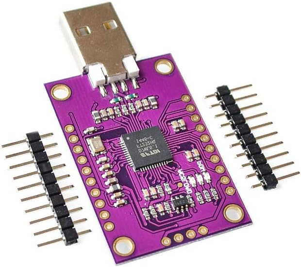
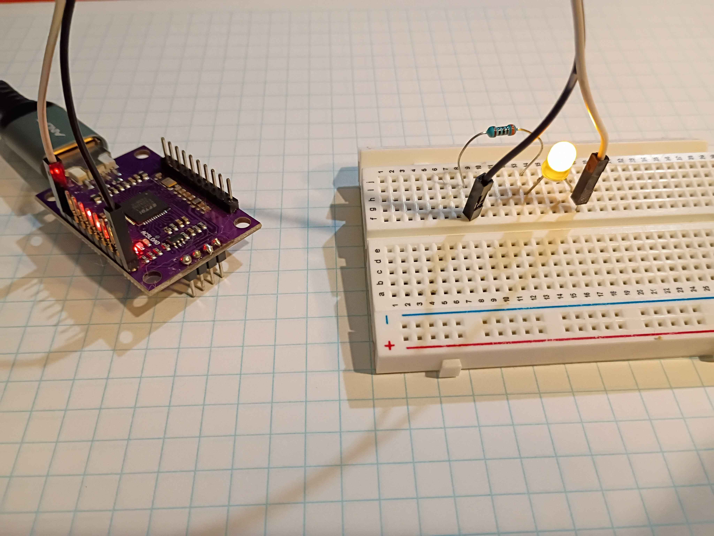

# FD232H

*Matt DiPalma, AMDG - April 22, 2026*

* [Datasheet](resources/DS_FT232H.pdf)



## Summary

The FT232H is not a conventional microcontroller like the others in this repository. It's marketed as a High-Speed USB to Multipurpose UART/FIFO IC. It's essentially a USB-to-GPIO breakout including peripherals like UART, I2C, SPI, JTAG, FIFO (parallel), etc. It's a good way to connect your computer with the outside world without using a separate microcontroller.

### Minimal Toolchain

The following minimal toolchain was verified on 6.19.9-arch1-1 x86_64 GNU/Linux.

You can use Python or C, among others.

To use Python, you will need the `pyftdi` library (install with `pip`). To use C, you will need `libftdi` (install with package manager).

To get the name/address of the device for use in Python, you can execute the below [or see this script](ex01_blink_python/get_ftdi_address.sh):

```python -c "from pyftdi.ftdi import Ftdi; Ftdi.show_devices()"```

# Circuit Setup

Connect FT232H to PC via USB and connect pins as necessary:



### Minimal Examples
* [ex01_blink_python](ex01_blink_python) - simple LED blink using Python
* [ex02_blink_c](ex02_blink_c) - simple LED blink using C


### Observations
